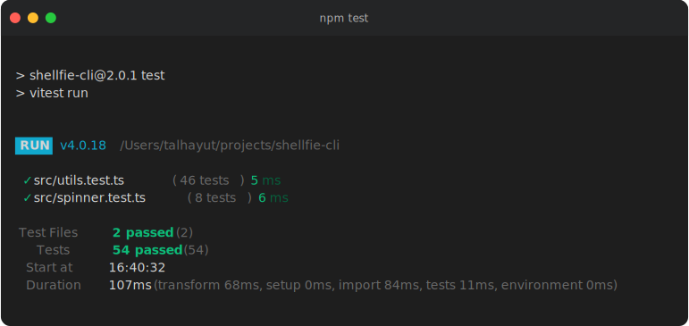
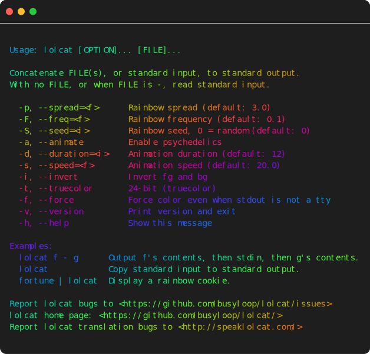

# shellfie-cli

Transform your terminal output into beautiful SVG screenshots, directly from the command line.

```sh
npm test | npx shellfie --title "Test Results" --theme dracula -o tests.svg
```



## Why shellfie-cli?

- **Zero friction** - Pipe any command output and get an SVG instantly
- **Beautiful defaults** - macOS-style terminal window with syntax highlighting
- **Fully customizable** - 12 themes, 3 templates, custom fonts, and more
- **Portable SVGs** - Embed fonts for consistent rendering everywhere
- **Lightweight** - Only 2 runtime dependencies

## Installation

```sh
# Use directly with npx (no install needed)
npx shellfie-cli --help

# Or install globally
npm install -g shellfie-cli

# Or add to your project
npm install shellfie-cli --save-dev
```

## Quick Start

### Pipe command output

```sh
# Capture npm test output
npm test 2>&1 | shellfie -o test-results.svg

# Capture git log
git log --oneline -10 | shellfie --title "Recent Commits" -o commits.svg

# Capture any command with colors
ls -la --color=always | shellfie --theme nord
```

```sh
lolcat --help | shellfie -o lolcat
```



### Read from a file

```sh
# Convert a log file to SVG
shellfie error.log -o error-screenshot.svg

# ASCII art
shellfie banner.txt --template minimal --theme monokai
```

### Output to stdout

```sh
# Pipe SVG to another command or file
cat output.txt | shellfie --stdout > output.svg

# Use with clipboard (macOS)
echo "Hello World" | shellfie --stdout | pbcopy
```

## Options

### Output

| Option | Alias | Description |
|--------|-------|-------------|
| `--output <path>` | `-o` | Output file path (default: `./shellfie.svg`) |
| `--name <name>` | `-n` | Output filename (without extension) |
| `--stdout` | | Print SVG to stdout instead of file |

### Appearance

| Option | Alias | Description |
|--------|-------|-------------|
| `--template <name>` | `-t` | Window style: `macos`, `windows`, `minimal` |
| `--theme <name>` | `-T` | Color theme (see [Themes](#themes)) |
| `--title <text>` | | Window title bar text |
| `--watermark <text>` | | Text in bottom-right corner |

### Dimensions

| Option | Description |
|--------|-------------|
| `--width <cols>` | Terminal width in columns (auto-detected) |
| `--padding <value>` | Padding in pixels. Single value or `top,right,bottom,left` |
| `--font-size <px>` | Font size in pixels (default: 14) |
| `--line-height <n>` | Line height multiplier (default: 1.4) |

### Styling

| Option | Description |
|--------|-------------|
| `--font-family <css>` | CSS font-family string |
| `--embed-font` | Embed system font for portable SVGs |
| `--no-controls` | Hide window control buttons |
| `--no-custom-glyphs` | Use font glyphs instead of pixel-perfect box drawing |

### Header & Footer

| Option | Description |
|--------|-------------|
| `--header-height <px>` | Enable custom header with height |
| `--header-color <hex>` | Header background color |
| `--footer-height <px>` | Enable footer bar with height |
| `--footer-color <hex>` | Footer background color |

### Utility

| Option | Description |
|--------|-------------|
| `--list-themes` | List all available themes |
| `--list-templates` | List all available templates |
| `--help`, `-h` | Show help |
| `--version`, `-v` | Show version |

## Themes

```sh
shellfie --list-themes
```

Available themes:

| Theme | Description |
|-------|-------------|
| `dracula` | Dark, vibrant purple |
| `nord` | Arctic, bluish colors |
| `tokyoNight` | Dark, moody |
| `oneDark` | VS Code One Dark |
| `monokai` | Classic dark |
| `catppuccinMocha` | Warm, cozy dark |
| `githubDark` | GitHub dark mode |
| `githubLight` | GitHub light mode |
| `gruvboxDark` | Retro dark |
| `gruvboxLight` | Retro light |
| `solarizedDark` | Solarized dark |
| `solarizedLight` | Solarized light |

## Templates

```sh
shellfie --list-templates
```

| Template | Description |
|----------|-------------|
| `macos` | macOS-style with traffic light buttons (default) |
| `windows` | Windows-style with square buttons |
| `minimal` | Clean, no window chrome |

## Examples

### Capture test results with a theme

```sh
npm test 2>&1 | shellfie --theme dracula --title "Unit Tests" -o tests.svg
```

### Git diff with minimal template

```sh
git diff HEAD~1 --color=always | shellfie -t minimal --theme githubDark -o diff.svg
```

### Custom padding and font size

```sh
cat script.sh | shellfie --padding "20,30" --font-size 12 -o script.svg
```

### Embed font for sharing

```sh
ls -la | shellfie --embed-font -o portable.svg
```

### Add watermark

```sh
neofetch | shellfie --watermark "@username" --theme nord
```

### Windows-style output

```sh
docker ps | shellfie -t windows --title "Docker Containers"
```

### With header and footer bars

```sh
htop -n 1 | shellfie --header-height 30 --footer-height 20 -o system.svg
```

## Tips

### Preserve colors

Many commands disable colors when piped. Force them with:

```sh
# ls
ls -la --color=always | shellfie

# grep
grep --color=always pattern file | shellfie

# git
git -c color.ui=always log | shellfie

# npm
npm test --color | shellfie
```

### Capture stderr too

Include error output with `2>&1`:

```sh
npm test 2>&1 | shellfie -o output.svg
```

### CI/CD Integration

```yaml
# GitHub Actions example
- name: Generate test screenshot
  run: npm test 2>&1 | npx shellfie-cli --theme githubDark -o test-output.svg

- name: Upload artifact
  uses: actions/upload-artifact@v4
  with:
    name: test-screenshot
    path: test-output.svg
```

### npm scripts

```json
{
  "scripts": {
    "test:screenshot": "npm test 2>&1 | shellfie --theme dracula -o tests.svg"
  }
}
```

## Related

- [shellfie](https://github.com/tool3/shellfie) - The core library for programmatic use

## License

MIT
